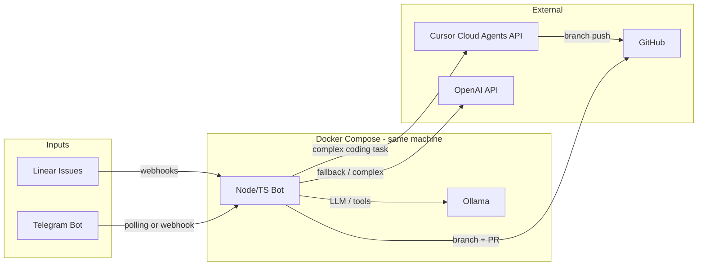

# Local Assistant Setup: LangChain, Ollama, Docker, Cursor, Linear, Telegram

## Target architecture

- **Linear**: Assign or @mention the bot on an issue → webhook hits your bot.
- **Telegram**: User sends a task or command → bot replies and can create/update Linear issues or trigger the same pipeline.
- **Bot (Node/TS in Docker)**: Single orchestrator that:
  - Receives events from Linear and Telegram.
  - Uses **LangChain + Ollama** for reasoning, summarization, and simple code/gen (and optional RAG if you add docs later).
  - Uses **OpenAI** when you want higher quality or longer context (e.g. complex planning, fallback).
  - Decides “simple” vs “complex” coding task; for complex ones calls **Cursor Cloud Agents API**; for simple ones applies changes (or generates a patch) and pushes to GitHub.
- **GitHub**: One repo (or more) with write access for both the bot and Cursor’s GitHub App. All work appears as branches; a small automation (e.g. GitHub Action or bot logic) opens a PR for every such branch → “always auto PR”.

---

## 1. Repo and Docker Compose layout

- **Single repo** (e.g. `Pedros` or `local-assistant`) containing:
  - `docker-compose.yml` (Ollama + bot service)
  - Bot app (Node/TS) in e.g. `app/` or `bot/`
  - Optional: `docs/` or `prompts/` for RAG later

`**docker-compose.yml` (conceptual):**

- **Service `ollama**`: Image `ollama/ollama`, port `11434` exposed to host and to bot. Persist models in a volume.
- **Service `bot**`: Build from Dockerfile in bot directory; env vars for Linear, Telegram, Cursor, OpenAI, GitHub; depends on `ollama`; optional `restart: unless-stopped`.

**Bot → Ollama:** Use `OLLAMA_BASE_URL=http://ollama:11434` from the bot container so LangChain (e.g. `@langchain/ollama`) talks to Ollama on the same machine.

---

## 2. Bot app (Node/TS)

- **Runtime**: Node 20+ with TypeScript (ts-node or compiled JS in Docker).
- **LangChain**:
  - `@langchain/ollama` for ChatOllama (and optionally OllamaEmbeddings if you add RAG).
  - `@langchain/core` for chains, messages, tools.
  - Optional: `langchain-openai` for OpenAI fallback when you want it.
- **Integrations**:
  - **Linear**: GraphQL client (e.g. `@linear/sdk` or raw `graphql-request`) + HTTP server for webhooks. Register webhook URL in Linear app (must be publicly reachable; use ngrok or similar in dev).
  - **Telegram**: `telegraf` or `node-telegram-bot-api`; either long polling (no public URL) or webhook (needs public HTTPS).
  - **Cursor**: REST client for [Cloud Agents API](https://cursor.com/docs/api) (Beta, available on your plan). Use API key from Cursor Dashboard → Integrations; call the “create / launch agent” endpoint with prompt + repo (and branch if needed).
  - **GitHub**: `@octokit/rest` or `octokit` with a PAT (or GitHub App) with repo write; create branch, commit files, push, then create PR.

**Orchestration logic (high level):**

- On Linear agent session event (issue delegated to bot): parse `agentSession` and `promptContext`, respond with a “thought” activity within 10s (Linear requirement), then enqueue work.
- On Telegram message: parse intent (e.g. “do task X”, “status”, “create issue”); optionally create/update Linear issue and delegate to self so one pipeline handles both.
- **Task router**: Use a small LangChain chain (or simple prompt with Ollama/OpenAI) to classify: “simple” (bot does it: edit/create a few files, run script) vs “complex” (trigger Cursor Cloud Agent). You can base this on issue labels, description length, or explicit user instruction.
- **Simple path**: LangChain + Ollama (or OpenAI) generates patch or file changes → bot applies to a branch → push → create PR via GitHub API.
- **Complex path**: Bot calls Cursor Cloud Agents API with prompt (e.g. issue title + description + acceptance criteria), repo URL, and base branch. Cursor runs the agent; it pushes to a branch. Your “always auto PR” layer opens a PR when that branch appears (or Cursor might expose a “PR created” callback—check latest docs).

---

## 3. Linear setup (and holes)

- Create a [Linear Application](https://linear.app/settings/api/applications/new); enable **webhooks** and **Agent session events**.
- OAuth with `actor=app` and scopes `app:assignable` and `app:mentionable` so the bot can be assigned as delegate and @mentioned.
- Store per-workspace access token and (if needed) app user ID after installation.
- **Hole / constraint**: Linear Agent API is **Developer Preview**; behavior may change. You must **acknowledge sessions quickly** (e.g. emit a “thought” within ~10s) and handle session lifecycle (pending → active → complete/error). Implement retries and idempotency for webhook delivery.

---

## 4. Cursor Cloud Agents (and holes)

- Get **Cloud Agents API** key from Cursor Dashboard → Integrations (your Cursor Pro subscription includes this).
- Bot calls the API to create a cloud agent run with: prompt (task description from Linear/Telegram), target repo, and base branch. Cursor clones the repo, runs the agent, and pushes to a new branch.
- **Holes**: (1) Exact endpoint and request shape (e.g. `POST /.../agents` or `/tasks`) are in [Cloud Agents API docs](https://cursor.com/docs/cloud-agent/api/endpoints)—fetch when implementing. (2) Whether Cursor creates the PR or only pushes the branch: if it only pushes, your “always auto PR” step must create the PR when that branch is pushed (e.g. GitHub Action or bot listening for branch events). (3) Rate limits apply; queue tasks if you trigger many agents.

---

## 5. GitHub and “always auto PR”

- **Credentials**: Bot needs repo write (PAT or GitHub App). Cursor needs repo access via its GitHub App (already required for Cloud Agents).
- **Bot-created branches**: After the bot applies changes (simple path), it creates a branch, commits, pushes, then calls GitHub API to open a PR (e.g. `octokit.pulls.create`).
- **Cursor-created branches**: If Cursor only pushes a branch and does not create a PR, add a **GitHub Action** (or a small webhook handler) that:
  - Listens for push events to branches matching a pattern (e.g. `cursor-agent/*` or `bot/*`), or
  - Uses `peter-evans/create-pull-request` or a script that creates a PR from the new branch to default.
- Ensure Actions have “Read and write permissions” (or use a PAT in the bot) so the workflow can create PRs.

---

## 6. Telegram

- Create a bot via [@BotFather](https://t.me/BotFather); store token in bot env.
- Use long polling in dev (no public URL) or set webhook to your public endpoint in prod.
- **Hole**: Webhook requires HTTPS and a public URL; for local dev either poll or expose with ngrok/tunnel.

---

## 7. OpenAI and secrets

- Use OpenAI for harder reasoning or as fallback; add `OPENAI_API_KEY` to bot env (and to Cursor Cloud Agent secrets if an agent ever needs it). Never commit keys; use Docker env or a secrets store.

---

## 8. Suggested project layout (after setup)

- `docker-compose.yml`
- `bot/` (or `app/`)
  - `package.json`, `tsconfig.json`, Dockerfile
  - `src/`: `index.ts`, `linear/`, `telegram/`, `cursor/`, `github/`, `langchain/` (or single `agent.ts` with modules)
  - Env: `LINEAR_WEBHOOK_SECRET`, `LINEAR_*`, `TELEGRAM_BOT_TOKEN`, `CURSOR_API_KEY`, `OPENAI_API_KEY`, `GITHUB_TOKEN`, `OLLAMA_BASE_URL`
- `.github/workflows/` (e.g. `auto-pr-on-bot-branch.yml` if you want PRs for Cursor-pushed branches)
- `.env.example` (no real secrets)

---

## 9. Holes and risks summary

| Area             | Risk / gap                                                                                                                       |
| ---------------- | -------------------------------------------------------------------------------------------------------------------------------- |
| **Linear**       | Agent API is Developer Preview; 10s ack requirement; webhook delivery and lifecycle may change.                                  |
| **Cursor**       | Confirm exact Cloud Agents API endpoint and payload; PR creation may be your responsibility when Cursor only pushes a branch.    |
| **Telegram**     | Webhook needs public HTTPS in prod; use polling or a tunnel in dev.                                                              |
| **Same machine** | Bot and Ollama in Docker is fine; ensure only necessary ports (e.g. 11434) are exposed if you care about local network security. |
| **GitHub**       | One PAT/App with minimal scope (repo write); consider branch protection so bot/Cursor branches require PR review.                |
| **OpenAI**       | Cost and rate limits; use for selected tasks only; monitor usage.                                                                |

---

## 10. Implementation order

1. **Docker Compose**: Ollama + a minimal Node/TS bot that only logs and exposes a health route.
2. **LangChain + Ollama**: Add a simple chain in the bot that calls Ollama (e.g. summarize or classify text).
3. **Linear**: Create app, webhook, and handler that acknowledges agent sessions and parses `promptContext`.
4. **Telegram**: Bot that echoes or runs a simple command (e.g. “ping” → “pong”).
5. **Task router**: Classify “simple” vs “complex” from issue or message content.
6. **Simple path**: Generate and apply a small change, push branch, create PR via GitHub API.
7. **Cursor Cloud Agents**: Integrate API call to launch agent with prompt + repo; handle async completion (poll or webhook if available).
8. **Auto PR for Cursor branches**: GitHub Action or bot logic to open PR when Cursor (or bot) pushes a branch.
9. **OpenAI**: Optional fallback in the router or in the “simple” path for better quality.
10. **Secrets and hardening**: Move all keys to env/secrets; add `.env.example`; optional rate limiting and idempotency for webhooks.

This gives you a single local assistant that uses Cursor for complex dev work and LangChain/Ollama (and optionally OpenAI) for the rest, with Linear and Telegram as entry points and GitHub as the place where every change becomes a branch and then a PR.